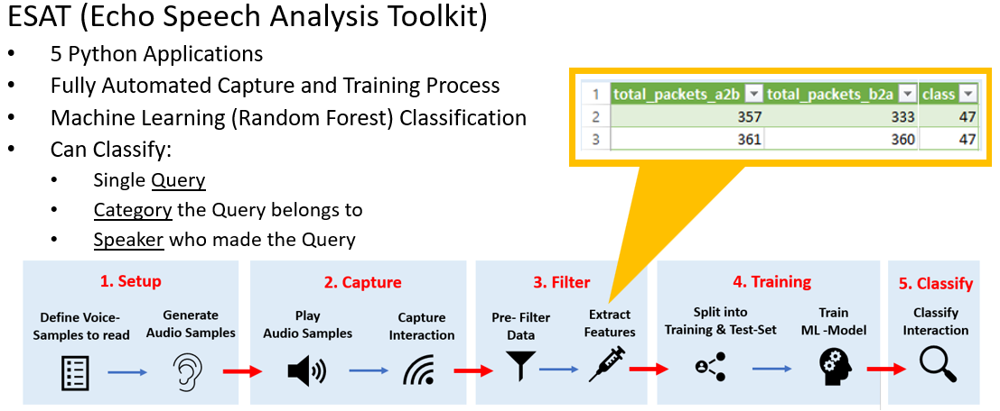

# Echo Speech Analysis Toolkit (ESAT)

- Author: Stefan Klapf
- Developed for my Master Thesis at the FH-Joanneum in 2021.

## Idea Overview

The Echo Speech Analysis toolkit was developed as part of my master's thesis. It allows a fully automated interaction
with an Amazon Alexa System and interception of the resulting network traffic. In addition, the ESAT takes care of the
training and classification of the gathered network data. From the captured network traffic, TCP features are extracted,
which are used to train 9 different random forest models. The primary aim of the solution was to automate the capture
and training process for the gathered network data.



## Toolkit Feature Overview:

The toolkit is divided into several python applications:

- [esat-capture-data](./src/python/esat-capture-data.py): Allows to capture and save network packages as pcap files.
- [esat-automatic-capture](./src/python/esat-automatic-capture.py): Allows a fully automated capture of alexa
  interactions.
- [esat-train-model](./src/python/esat-train-model.py): Trains 9 different ML model based on the provided training data.
- [esat-analyze-data](./src/python/esat-analyze-data.py): Analyzes pcap files classifys them using the previously
  trained random forest model.
- [esat-validate-helper](./src/python/utils/esat-validate-helper.py): Allows additional reports and matrices to be
  generated from the trained models.

## Requirements

Requirements for installing und using the ESAT:

- Linux Operating System: The tool was developed and tested on Ubuntu 20.04
- Amazon Echo Dot Gen3 or Gen4

## SETUP

The tool was tested on Ubuntu 20.04. It requires a user with sudoer privileges to be run because it uses linux command
line applications to capture network traffic from an interface.

Install the following linux package dependencies:

```bash
# sudo apt install python3              // Python 3
# sudo apt install python3-pip          // Pip3 packet manager
# sudo apt install wireshark-common     // Dumcap Tool
# sudo apt install tcptrace             // Tcptrace
# sudo apt install ffmpeg               // For playing audio
```

Run pip3 in the "./src/python/" directory to install the required python dependencies:

```bash
# sudo pip3 install -r requirements.txt
```

Edit the ``esat-config.ini``:

Enter the corresponding values for your setup in "EchoMACAddress" and "ETHInterface". Add the AWS keys if you intend to
use the automatic generation of audio sample files.

```ini
[BASIC]
EchoMACAddress = ff:ff:ff:ff:ff:ff
ETHInterface = enp6s0
[AWS_POLLY]
AWS_ACCESS_KEY_ID = YOUR_AWS_ACCESS_KEY_ID
AWS_SECRET_ACCESS_KEY = YOUR_SECRET_AWS_ACCESS_KEY
[DIRECTORIES]
CAPTURE_DIR = ./caps/
MODEL_DIR = ./model/
TRAINING_DATA_DIR = ./trainings_data/
```

Setup is done.

## Using the tool

The general workflow of the tool consists of 3 steps:

1. Capture data
2. Train models based on the captured data
3. Classify pcap files

Quick overview about the tool usage:

```bash
sudo python3 esat-capture-data.py -file test-capture01  # capture a single alexa interaction and save it to the file test-capture01
sudo python3 esat-automatic-capture.py                  # Starts the automatic alexa interaction and capture process.
sudo python3 esat-analyze-data.py -file ./caps/test-capture01.pcap # Classify a single pcap file based on the trained models.
sudo python3 esat-validate-helper.py                    # Generate additional reports the the gathered data
```

The following section describes the 3 parts of the toolset in more detail.

### Capture Data

The capture process can be initiated in two ways. Individual network captures can be captured using the
[esat-capture-data](./src/python/esat-capture-data.py) tool. The following shows a snippet of the command line after
starting the capture-data tool.

```bash
stefan@stefan-PowerEdge-T30:~/esat$ sudo python3 esat-capture-data.py -file test-capture01
    ___________ ___  ______            ______            __
   / ____/ ___//   |/_  __/           / ____/___ _____  / /___  __________
  / __/  \__ \/ /| | / /    ______   / /   / __ `/ __ \/ __/ / / / ___/ _ \
 / /___ ___/ / ___ |/ /    /_____/  / /___/ /_/ / /_/ / /_/ /_/ / /  /  __/
/_____//____/_/  |_/_/              \____/\__,_/ .___/\__/\__,_/_/   \___/
                                              /_/

Echo Speech Analysis Toolkit - Capture, Version 1.0

  [-] Echo Mac Address: ff:ff:ff:ff:ff:ff
  [-] Capture started on: 2021-08-25 22:51:58.911647
  [-] To stop the capture press 'CTRL+C'

Capturing on 'enp6s0'
File: ./caps/test-capture01_00001_20210825225158.pcap
Packets captured: 0
Packets received/dropped on interface 'enp6s0': 0/0 (pcap:0/dumpcap:0/flushed:0/ps_ifdrop:0) (0.0%)
Capture aborted!
```

To automatically initiate Alexa interactions over a loudspeaker and to capture the resulting network traffic, the
[esat-automatic-capture](./src/python/esat-automatic-capture.py) tool is used. This generates a total of 3 voice samples
for each query defined in the voice_commands.csv. These samples are then played via a connected loudspeaker in order to
start an Alexa interaction. The following shows a snippet of the command line after starting the automatic-capture tool.

```bash
[+] Generate voices finished!
Doing iteration [0 / 1]
[+] Starting automatic capture!
[*] Directory: 47
   Starting capture for file: ./trainings_data/47/47_multi_info_Vicki_wer_ist_der_hauptdarsteller_in_titanic.mp3 with duration: 21 sec

  [-] Capture started on: 2021-08-25 22:50:07.496417
Capturing on 'enp6s0'
File: ./trainings_data/47/47_multi_info_Vicki_wer_ist_der_hauptdarsteller_in_titanic_00001_20210825225007.pcap
Playing audio: ./trainings_data/47/47_multi_info_Vicki_wer_ist_der_hauptdarsteller_in_titanic.mp3
```

The capture process for both tools can be aborted with: ``CTRL+C``

### Train Model

After capturing the desired number of samples, the random forest model can be trained. In the course of this work, 9
different random forest models were generated. At the end of the training step, classifcation reports, confusion
matrices are generated for each model and saved to the file system under "./reports/" In addition, during the training of
the models, a classifcation report is output in the console.

```bash
Classification Report:
               precision    recall  f1-score   support

         fun       0.80      0.77      0.78       424
        info       0.85      0.93      0.89      1106
       music       1.00      1.00      1.00       289
        news       0.82      0.60      0.69       212
        time       0.82      0.83      0.83       228
     weather       0.82      0.77      0.79       503

    accuracy                           0.85      2762
   macro avg       0.85      0.82      0.83      2762
weighted avg       0.85      0.85      0.85      2762

Cross Validation: 0.64
Accuracy: 0.8490224475018103
```

### Classify PCAP Files

To classify a single captured pcap file based on the previously trained models, it is simply passed via command line
argument. At the end of the analysis, a table is printed that contains the results of the classification. In addition, a
csv report is saved in the root directory of the esat. The following shows a snippet from the console for the classification of an single pcap file.

```bash
stefan@stefan-PowerEdge-T30:~/esat$ sudo python3 esat-analyze-data.py -file ./caps/info-lugner_00001_20210630105152.pcap
    ___________ ___  ______            ___                __
   / ____/ ___//   |/_  __/           /   |  ____  ____ _/ /_  ______  ___
  / __/  \__ \/ /| | / /    ______   / /| | / __ \/ __ `/ / / / /_  / / _ \
 / /___ ___/ / ___ |/ /    /_____/  / ___ |/ / / / /_/ / / /_/ / / /_/  __/
/_____//____/_/  |_/_/             /_/  |_/_/ /_/\__,_/_/\__, / /___/\___/
                                                        /____/

Echo Speech Analysis Toolkit - Analyze Data, Version 1.0
Started analysis on: 2021-08-25 23:26:26.188691
---------------------------------------------------------------------------------------------------------------------------
Starting classification...
 [-] File:     './caps/info-lugner_00001_20210630105152.pcap'
 [-] Echo Mac: ff:ff:ff:ff:ff:ff
+----------------------------------------------+----------+-------------+-------------+---------------+------------------+------------------+----------------+-------------------+-------------------+
| File                                         |   ID All |   ID A Only |   ID B Only | Speaker All   | Speaker A Only   | Speaker B Only   | Category All   | Category A Only   | Category B Only   |
|----------------------------------------------+----------+-------------+-------------+---------------+------------------+------------------+----------------+-------------------+-------------------|
| ./caps/info-lugner_00001_20210630105152.pcap |       15 |          15 |          11 | Hans          | Hans             | Hans             | info           | weather           | info              |
+----------------------------------------------+----------+-------------+-------------+---------------+------------------+------------------+----------------+-------------------+-------------------+
Analysis of file is finished!


Analysis finished. Closing Program!
Finished analysis on: 2021-08-25 23:26:30.774590
```